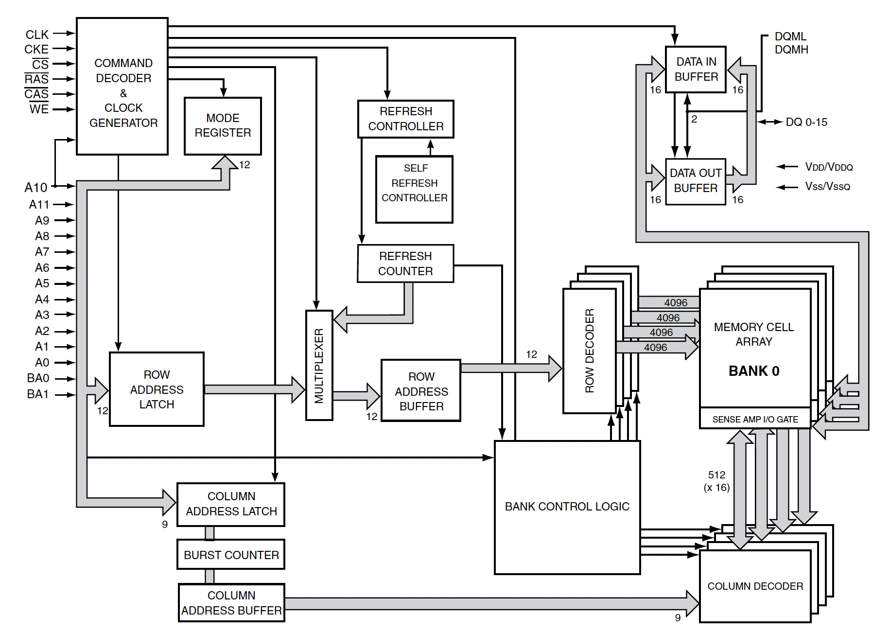
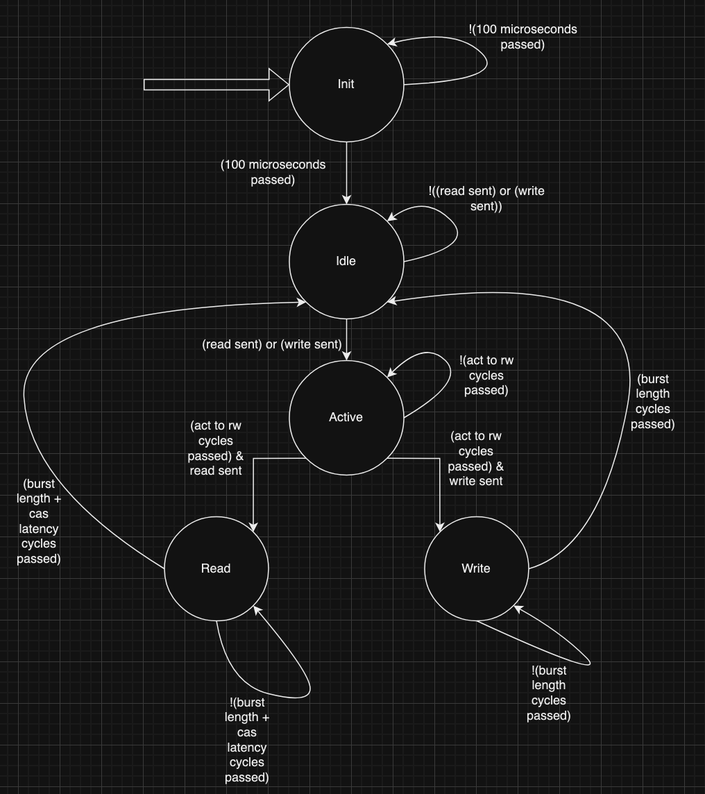
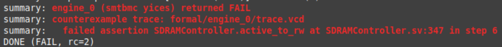
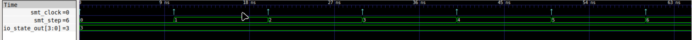
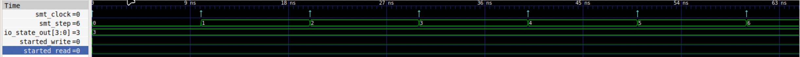
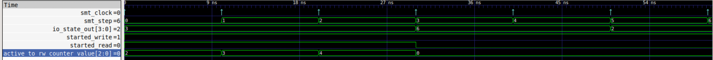
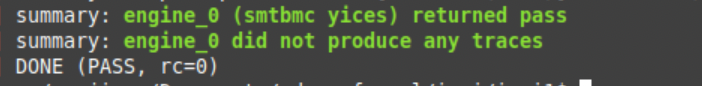

## Layout of Presentation

- SDRAM Controller Generator Introduction
- Finite State Machine Internals and Specification
- SystemVerilog Assertions
- SystemVerilog Assertion Generation
- Results
- Challenges
- Future Work

## SDRAM Controller Generator Introduction

- Uses Chisel/Scala to generate RTL to describe the behavior of a finite state machine to setup and index an SDRAM memory module
- JSON files are inputted, representing SDRAM memory datasheets to include various timing parameters , into the Scala program

## DRAM Indexing



## Finite State Machine Diagram



## Finite State Machine Specification

- Init State - Must stay here for 100 microseconds, can never return here unless reset is asserted, must transition to idle state after 100 microseconds and 3 cycles
- Idle State - Must transition to Active state if a read or write request is asserted on the next cycle
- Active State - Must transition to read or write state after the appropriate amount of cycles have passed
- Read State - Must assert read data valid after the appropriate amount of cas latency cycles have passed, must transition back to idle state after the appropriate amount of cas latency plus burst length cycles have passed
- Write State - Must transition to idle state after the appropriate amount of burst length cycles have passed

## SystemVerilog Assertions

- An assertion is a statement about your design that you expect to be true always. - Formal Verification, Erik Seligman et al.
- Require formal verification tools to read - Yosys - SymbiYosys
- Used as targets for proofs rather than basic checks
- Two types: immediate and concurrent
  - Immediate - purely combinational logic, evaluated at any time step
  - Concurrent - evaluated at specific points in time, allow for strings of events across time

## Using SymbiYosys

- Front-end for formal verification based off Yosys
- Interface with different SMT solvers - picked yices2
- Displays counterexamples on a .vcd file to be opened with GTKWave
- .sby scripts can be used for automation

## .sby script example

```
[options]
mode bmc
depth 20

[engines]
smtbmc yices

[script]
read -formal SDRAMController.sv
prep -top SDRAMController

[files]
SDRAMController.sv
```

## Constructing the first assertion {data-state="has-sub-slides"}

- Take one of the provided specifications for the active state: Must transition to read or write state after the appropriate amount of cycles have passed
- Below is how one would compose that into SVA

**assert property (@(posedge clock) disable iff (reset) io_state_out == 3 |=> ##5 (io_state_out == 6 | io_state_out== 7) )**

---

### Running the first assert



---

### Why the first assert failed



---

### Why the first assert failed in more detail



---

### Is my code wrong?

```scala
is(ControllerState.idle) {
    state := ControllerState.idle
    //address holds row right now
    read_state_counter.reset()
    write_state_counter.reset()
    val go_to_active =
    io.read_start | io.write_start
    //nop command
    sdram_commands.NOP()
    //read and write isnt valid
    io.read_data_valid := false.B
    io.write_data_valid := false.B
    when(refresh_outstanding) {
    sdram_commands.Refresh()
    refresh_outstanding := false.B
    }.elsewhen(go_to_active) {
    state := ControllerState.active
    //active command - make this a function
    val row_and_bank = io.read_row_address
    sdram_commands.Active(row_and_bank)
    cas_counter.reset()
    when(io.read_start) {
        started_read := true.B
    }.elsewhen(io.write_start) {
        started_write := true.B
    }
    }
}
```

---

### SystemVerilog assume keyword

- Used to reduce cone of influence of the design
- Below is an example of an assume statement

**assume property (@(posedge clock) disable iff (reset) (started_read | started_write))**

---

### Including Assumptions



Assumption created new counter-example: active to rw counter can be in the middle of counting

---

### Another Assumption

**assume property (@(posedge clock) disable iff (reset) (active_to_rw_counter_value == 0))**



## Final Assertions and their Assumptions {data-state="has-sub-slides"}

---

### Init to Idle

```verilog
init_to_idle:
	assume property (@(posedge clock) disable iff (reset) (hundred_micro_sec_counter_value == 12503));
	assert property (@(posedge clock) disable iff (reset) io_state_out == 1 |=> io_state_out == 2);
```

---

### Idle to Active

```verilog
idle_to_active:
	assume property (@(posedge clock) disable iff (reset) (~refresh_outstanding));
	assert property (@(posedge clock) disable iff (reset) (io_state_out == 2) & (io_read_start | io_write_start) |=> io_state_out == 3);
```

---

### Active to Read or Write

```verilog
active_to_rw:
	assume property (@(posedge clock) disable iff (reset) (started_read | started_write));
	assume property (@(posedge clock) disable iff (reset) (cas_counter_value == 0));
	assume property (@(posedge clock) disable iff (reset) (active_to_rw_counter_value == 0));
	assert property (@(posedge clock) disable iff (reset) (io_state_out == 3) |-> ##4 ((io_state_out == 6) | (io_state_out == 7)));
```

---

### Never Reaches Init after Reset

```verilog
never_reaches_init_after_reset:
	assume property (@(posedge clock) disable iff (reset) (io_state_out > 1));
	assert property (@(posedge clock) disable iff (reset) (io_state_out != 1));
```

---

### Read to Valid Data

```verilog
read_to_valid_data:
	assume property (@(posedge clock) disable iff (reset) (read_state_counter_value == 0));
	assert property (@(posedge clock) disable iff (reset) (io_state_out == 6) |=> ##2 (io_read_data_valid) );
```

---

### Read to Idle

```verilog
read_to_idle:
	assume property (@(posedge clock) disable iff (reset) (read_state_counter_value == 0));
	assert property (@(posedge clock) disable iff (reset) (io_state_out == 6) |=> ##10 (io_state_out == 2) );
```

---

### Write to Idle

```verilog
write_to_idle:
	assume property (@(posedge clock) disable iff (reset) (write_state_counter_value == 0));
	assert property (@(posedge clock) disable iff (reset) (io_state_out == 7) |=> ##8 (io_state_out == 2) );
`endif // FORMAL
```

## How SV Assertions are Generated

- Given this program is a hardware generator, assertions must be generated according to the provided parameters
- Created “SVA_Modifier” Scala package and class
- Takes in the same SDRAM Parameter Case used to define all parameters for state machine generation
- Writes in SV assertions and assumptions with basic file IO

## Init to Idle Assertion Generator Example

```scala
def init_to_idle_assertion(): Unit = {
val lines = Source.fromFile(filePath).getLines().toList
val cycles_for_init_to_idle = sdram_params.cycles_for_100us + 3
val block_name = "init_to_idle:\n"
val assumption1 =
    s"\tassume property (@(posedge clock) disable iff (reset) (hundred_micro_sec_counter_value == $cycles_for_init_to_idle));\n"
val main_property =
    s"\tassert property (@(posedge clock) disable iff (reset) io_state_out == 1 |=> io_state_out == 2);\n"
val assert_block = block_name.concat(assumption1).concat(main_property)
val updatedLines = lines :+ assert_block
Files.write(
    Paths.get(filePath),
    updatedLines.mkString("\n").getBytes,
    StandardOpenOption.TRUNCATE_EXISTING,
    StandardOpenOption.WRITE
)
}
```

## Main Program SVA Injection

```scala
new File("SDRAMController.v").renameTo(new File(sdram_sv_name))
val sva_mods = new SVA_Modifier(s"$curr_dir/$sdram_sv_name", params)
sva_mods.begin_formal_block()
sva_mods.init_to_idle_assertion()
sva_mods.idle_to_active_assertion()
sva_mods.active_to_rw_assertion()
sva_mods.never_reaches_init_after_reset_assert()
sva_mods.read_to_valid_data_assert()
sva_mods.read_to_idle_assert()
sva_mods.write_to_idle_assert()
sva_mods.end_formal_block()
```

## Design Space Exploration and Results

- Tested 8 different designs for ISSI IS42S81600 and Winbond W9825G6KH SDRAM memories
- Changed clock frequency (100 to 200MHz), CAS latency (2 and 3), and burst lengths (1 to 8)
- All assertions passed after cone of influence was correctly refined by assume statements
- Fixed bugs with read and write states not behaving according to spec
  - Read exited at cas latency being reached, write would only write one item regardless of burst length

## Challenges

- Lack of good documentation of the open source tools
- Open Source Tools - they’re awful, but they are free :D
  - Don’t support esoteric SystemVerilog features - mainly bi-directional ports
- Licensing
- Learning to read counter-examples
- Failing assertions doesn’t necessarily mean your specification is wrong

## Calls for Contributions and Questions

[https://github.com/gmejiamtz/sdram_controller_generator](https://github.com/gmejiamtz/sdram_controller_generator)

No tool installation required due to Github Codespaces!
